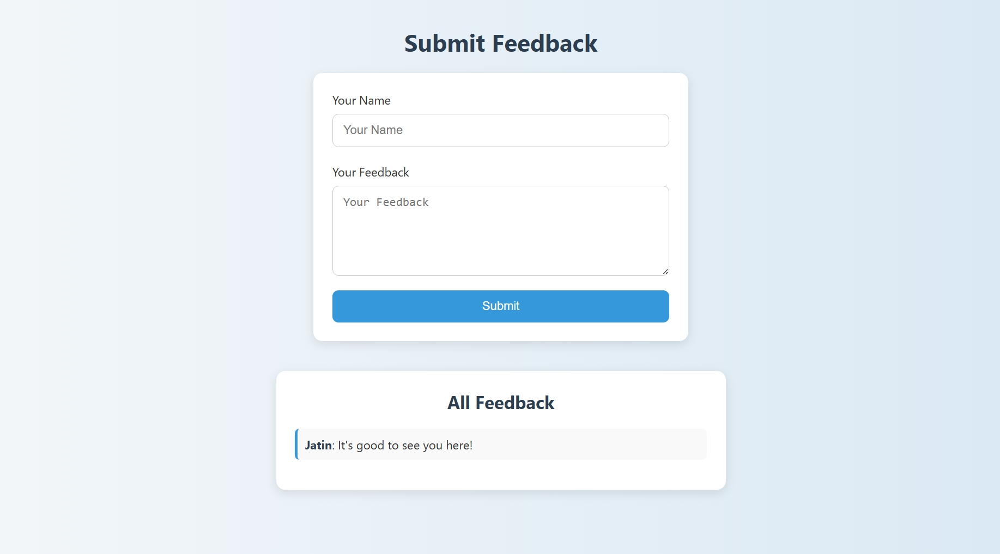
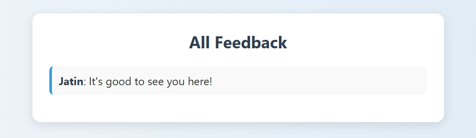

<h1 align="center">📬 Flask Feedback Collection App</h1>

<p align="center">
  
  
  
</p>

<p align="center">
  A lightweight web application for collecting and viewing feedbacks, powered by Flask and deployed via GitHub Actions + Docker + Railway CI/CD pipeline.
</p>

---

## 🚀 Live Demo

🔗 [Click here to view the live app](https://flask-feedback-app-tnxh.onrender.com)

---

## 🎯 Features

✅ Submit feedback (name + message)  
✅ View all feedbacks on homepage  
✅ Dockerized Flask backend  
✅ Auto-deploy with GitHub Actions CI/CD  
✅ SQLite database integration  
✅ Minimal, clean UI

---

## 📸 Preview

| Submit Feedback           | Feedback List             |
| ------------------------- | ------------------------- |
|  |  |

>

---

## 🧰 Tech Stack

| Technology        | Use                        |
| ----------------- | -------------------------- |
| 🐍 Python         | Core language              |
| 🌐 Flask          | Web framework              |
| 🐘 SQLite         | Lightweight local database |
| 🐳 Docker         | Containerization           |
| 🧪 GitHub Actions | CI/CD automation           |
| 🚄 Railway        | Cloud hosting platform     |
| 🎨 HTML (Jinja2)  | Templating                 |

---

## 📁 Project Structure

```

flask-feedback-app/
├── app.py
├── models.py
├── templates/
│   └── index.html
├── requirements.txt
├── Dockerfile
├── .dockerignore
├── .github/
│   └── workflows/
│       └── deploy.yml

```

---

## 🛠️ Setup Instructions (Local Dev)

### 1. Clone this repo

```bash
git clone https://github.com/YOUR_USERNAME/flask-feedback-app.git
cd flask-feedback-app
```

### 2. Create virtual environment

```bash
python -m venv venv
source venv/bin/activate  # or venv\Scripts\activate on Windows
```

### 3. Install dependencies

```bash
pip install -r requirements.txt
```

### 4. Run locally

```bash
python app.py
```

Go to `http://localhost:5000`

---

## 🐳 Docker Support

### Build & Run Locally

```bash
docker build -t feedback-app .
docker run -p 5000:5000 feedback-app
```

---

## 🔁 GitHub Actions CI/CD Pipeline

This project uses GitHub Actions to:

- ✅ Run builds
- ✅ Install dependencies
- ✅ Build Docker image
- ✅ Deploy to Railway on every push to `main`

### Deployment Config: `.github/workflows/deploy.yml`

```yaml
on:
  push:
    branches: [main]
```
---

## 🤝 Contributing

Want to improve this project?

```bash
git checkout -b feature/your-feature-name
git commit -m "✨ Added new feature"
git push origin feature/your-feature-name
```

Then open a **Pull Request** 🚀

---

## 📄 License

This project is licensed under the **MIT License** - see the [LICENSE](LICENSE) file for details.

---

<p align="center">
  Made with ❤️ using Flask, Docker and GitHub Actions
</p>
